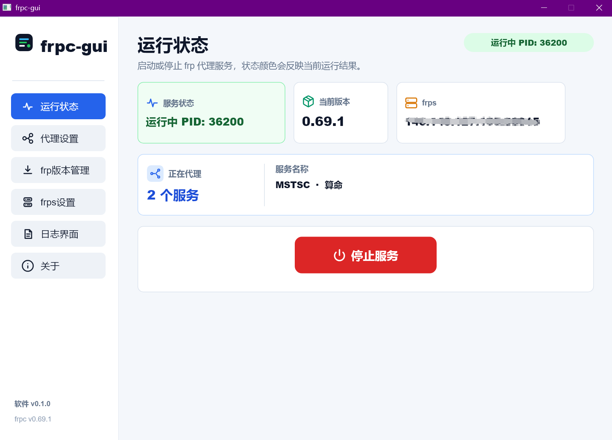
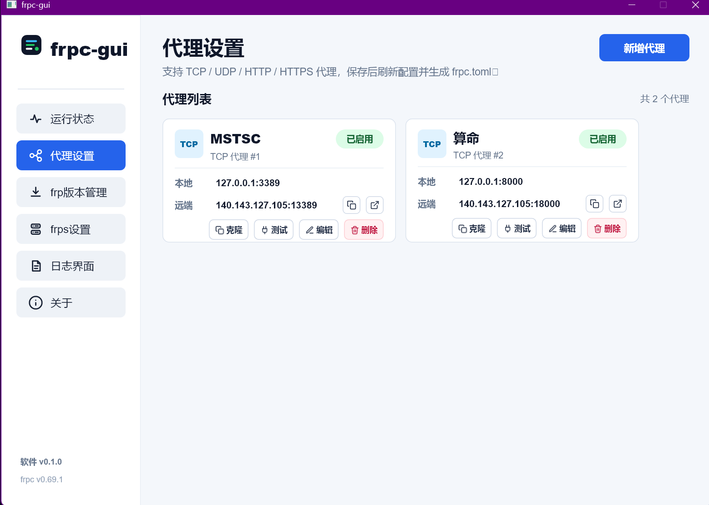
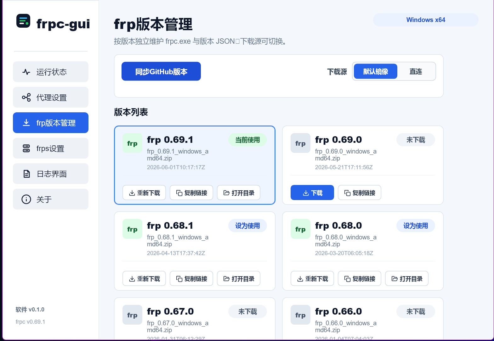
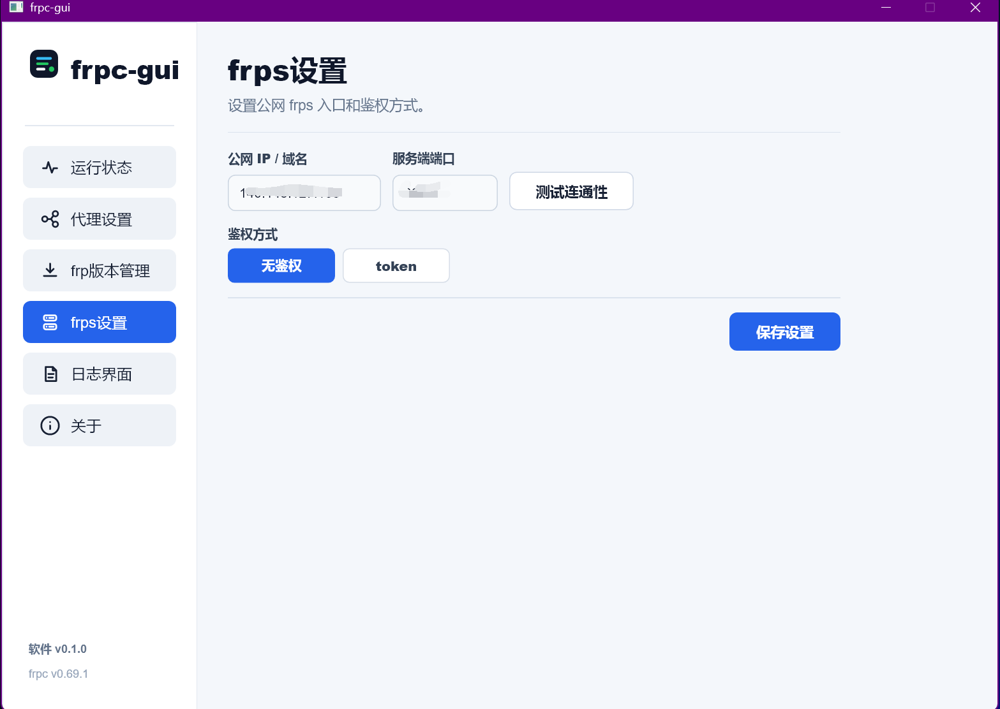
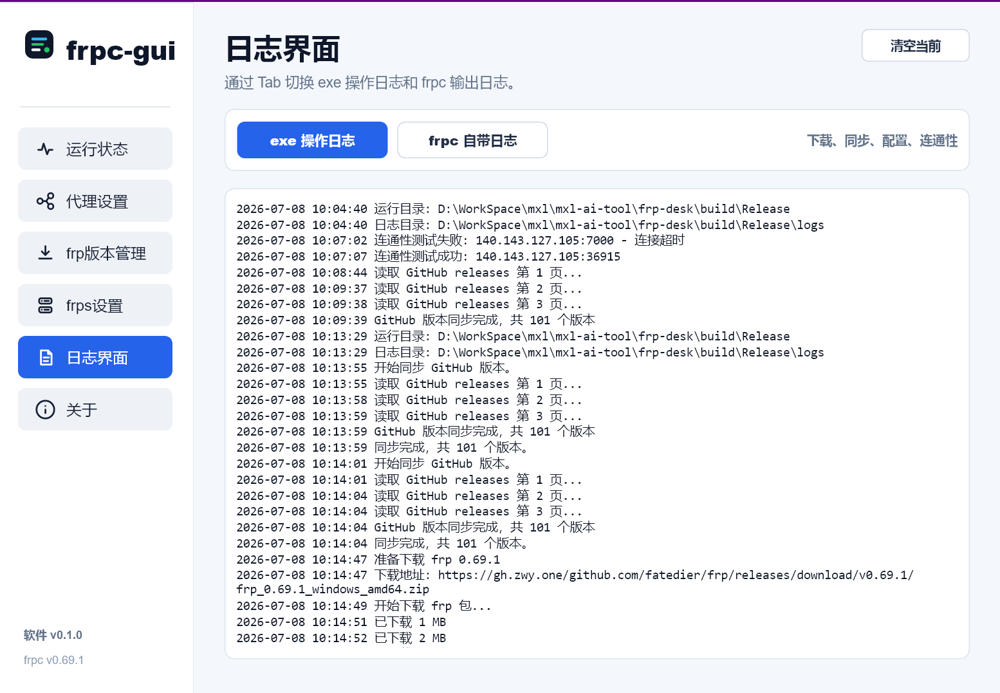

特别感谢原项目 [luckjiawei/frpc-desktop](https://github.com/luckjiawei/frpc-desktop)，本项目的主要界面均参考了该程序。

# frpc-gui

一个面向 Windows x64 的轻量级 frp 客户端管理工具。

项目使用 **C++17 + Slint 1.16** 构建桌面界面，通过子进程运行 frp 官方 `frpc.exe`。不使用 Electron、Tauri、WebView、Qt、MFC 或 .NET，支持版本管理、多代理配置、连接测试、运行状态和日志查看。

- 当前版本：`0.1.0`
- 支持平台：Windows 10 / 11 x64
- 项目地址：[github.com/ml863606/frpc-gui](https://github.com/ml863606/frpc-gui.git)

## 为什么重新造轮子

`frpc-desktop` 已经是一款很完整的 frp 桌面客户端。重新做一个并不是因为原项目不好，主要是想针对自己的使用习惯，把一些细节做得更直接：

0. 希望避免较重的桌面套壳，尽量降低常驻内存占用。
1. 连接公网 frps-server 时，直接测试服务端 IP 和端口是否连通，不必先启动再翻日志判断。
2. 新增或编辑代理时，分别测试本地端口和远端端口，并在界面显示绿色对号或红色叉号。
3. 原作功能非常丰富，但我的日常场景几乎只使用 TCP。本项目更关注常用流程和操作细节，TCP 也是默认代理类型。
4. 闲着练手，哈哈。

## 界面预览

### 运行状态

集中展示 frpc 运行状态、当前版本、frps 地址以及正在代理的服务。主操作按钮会根据状态切换为启动或停止。



### 代理设置

支持 TCP、UDP、HTTP、HTTPS 多代理配置。每个代理可独立启停，并支持克隆、测试、编辑、删除、复制远端地址和直接访问。



### frp 版本管理

从 GitHub Releases 同步 Windows amd64 版本，按发布时间倒序展示。不同版本独立安装，可切换下载源、下载或重新下载、复制链接、打开目录并设为当前使用版本。



### frps 设置

配置公网 IP 或域名、服务端端口和鉴权方式。默认不鉴权，也可以启用 token，并可在保存前测试服务端端口连通性。



### 日志界面

通过 Tab 分别查看软件操作日志和 frpc stdout/stderr 日志。日志区域支持滚动、文本选择、复制和清空。



## 主要功能

- 一键启动、停止当前版本的 `frpc.exe`
- 自动识别运行中的 frpc 进程并显示 PID
- 展示当前代理数量和已启用的服务名称
- 支持 TCP、UDP、HTTP、HTTPS 多代理
- 代理新增、克隆、编辑、删除和独立启停
- 分别测试代理的本地端口和远端端口
- 远端地址复制和 HTTP/HTTPS 直接访问
- 同步 fatedier/frp 的 GitHub Releases
- 版本列表按发布时间倒序保存和展示
- 每个 frpc 版本使用独立安装目录
- 默认镜像下载和 GitHub 直连下载
- 下载进度、已下载状态和本地目录快捷入口
- frps 无鉴权和 token 鉴权
- frps 服务端口连通性测试
- 软件操作日志与 frpc 原生日志分离
- 自动生成 `frpc.toml`
- 最小化到系统托盘
- 软件更新检查入口

## 快速使用

1. 启动 `frpc-gui.exe`。首次启动不会自动下载 frpc。
2. 打开“frp版本管理”，点击“同步GitHub版本”。
3. 选择默认镜像或直连，下载需要的版本。
4. 在版本卡片右上角点击“设为使用”。
5. 打开“frps设置”，填写公网 IP 或域名、端口和鉴权方式。
6. 打开“代理设置”，新增一个或多个代理并按需测试端口。
7. 返回“运行状态”，点击“启动服务”。

## 版本同步与下载

版本同步使用 GitHub Releases API：

```text
https://api.github.com/repos/fatedier/frp/releases?per_page=100&page=N
```

程序只保留 Windows amd64 压缩包信息，并写入一个汇总文件：

```text
versions\frp-versions.json
```

默认镜像地址：

```text
https://gh.zwy.one
```

镜像下载地址按以下规则拼接：

```text
<镜像地址>/github.com/fatedier/frp/releases/download/v<版本号>/<压缩包名>
```

例如：

```text
https://gh.zwy.one/github.com/fatedier/frp/releases/download/v0.69.1/frp_0.69.1_windows_amd64.zip
```

选择“直连”时使用 GitHub Release 原始下载地址。

## 运行目录

frpc-gui 采用便携式目录结构，所有配置、版本和日志都保存在 `frpc-gui.exe` 同级目录：

```text
frpc-gui.exe
slint_cpp.dll
config.json                    # 软件配置
frpc.toml                      # 自动生成的 frpc 配置
versions\
  frp-versions.json            # GitHub 版本汇总
bin\
  <版本号>\
    frpc.exe                   # 独立版本的 frpc
downloads\                    # 下载包和解压目录
logs\
  app.log                      # 软件操作日志
  frpc.log                     # frpc stdout/stderr 日志
```

需要手动安装 frpc 时，将 `frpc.exe` 放入：

```text
bin\<版本号>\frpc.exe
```

## 构建

### 环境要求

- Visual Studio 2022 C++ Build Tools 或更新版本
- CMake 3.21+
- Windows x64
- 系统提供 `tar.exe`，用于解压下载的 frp zip 包

仓库已包含 Slint C++ 1.16.0 的 Windows MSVC x64 运行包：

```text
third_party\slint\1.16.0\
```

### Release 构建

```powershell
cmake -S . -B build -G "Visual Studio 17 2022" -A x64
cmake --build build --config Release
```

使用更新版本 Visual Studio 时，将 generator 名称改为本机对应版本。构建输出：

```text
build\Release\frpc-gui.exe
build\Release\slint_cpp.dll
```

## 自动构建与发布

推送到 `main` 分支后，GitHub Actions 会自动：

1. 使用 GitHub Windows Runner 上已安装的 Visual Studio 编译 x64 Release。
2. 从 Slint 官方 Release 获取构建所需的 `slint-compiler.exe`。
3. 打包 `frpc-gui.exe`、`slint_cpp.dll` 和 `README.md`。
4. 上传 ZIP 到本次 Actions 的构建产物。
5. 从 `src/app_version.h` 读取版本号。
6. 如果对应的 `v<版本号>` Tag 不存在，自动创建 Tag 和 GitHub Release，并上传 ZIP。

发布新版本前只需要修改：

```cpp
#define FRPC_GUI_VERSION_STRING "0.1.0"
```

同时更新该文件中的 major、minor、patch 和 Windows 版本资源对应值。若 Tag 已存在，工作流仍会编译和上传构建产物，但不会重复创建 Release。

## 技术实现

| 模块 | 实现 |
| --- | --- |
| 桌面界面 | Slint 1.16 / Fluent Style |
| 主程序 | C++17 / Win32 |
| 网络请求 | WinHTTP |
| 端口测试 | Winsock |
| frpc 进程 | `CreateProcessW` + stdout/stderr 管道 |
| 配置 | `config.json` + 自动生成 `frpc.toml` |
| 版本解压 | Windows `tar.exe` |

## 项目结构

```text
src\
  main.cpp                     # 应用入口、页面回调和状态协调
  config.*                     # 配置读写与 frpc.toml 生成
  frpc_manager.*               # frpc 下载、启动、停止和日志管道
  version_manager.*            # GitHub 版本同步与汇总文件
  app_update.*                 # 软件版本更新检查
ui\
  app.slint                    # 主窗口、导航和页面组装
  components\                  # 通用 Slint 组件
  pages\                       # 页面级独立模块
resources\
  icons\                       # 通用 SVG 图标
  status-icons\                # 运行状态页图标
  logo\                        # 软件 Logo 和 Windows 图标
docs\                           # README 界面截图
.github\workflows\release.yml  # Windows 构建、打包和 Release 发布
```
